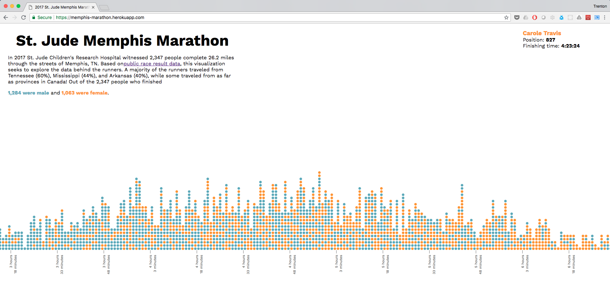

Marathon Visualization
======================




The goal of this visualization is to uncover all the interesting stories nested in the [St. Jude Marathon results](http://www.besttimescct.com/results/marathon-results-by-place-2017.HTML). Pull Requests are welcome and feature ideas can be added to the ["Ideas" column](https://github.com/trentontri/marathon/projects/1#column-3385384)  of the [project's card wall.](https://github.com/trentontri/marathon/projects/1) For questions email trenton.kennedy@stjude.org

## Quick Overview
The front-end code for this project runs on [D3.js](https://d3js.org/) and [Create React App](https://github.com/facebookincubator/create-react-app) with [Node.js](https://nodejs.org/en/) on the back-end running a basic server.

To run the project locally execute these commands:
```
git clone https://github.com/trentontri/marathon.git
npm install
npm run start
```
## Pull Requests
To contribute any code changes you must create a new branch off of `master` and submit it as a Pull Request. Once the changes have been reviewed your branch will be merged into master.

## Deployments
Deployments to https://memphis-marathon.herokuapp.com/ happen automatically when changes are made to the `master` branch.

## Scraping Results Data
Please make sure you have properly installed Python 3 and pip, follow [this guide](https://docs.python-guide.org/starting/installation/) if you haven't. Once Python 
[Running Python3 on OSX](https://wsvincent.com/install-python3-mac/)

`cd results-scraper/`


install Python's virtual environment `python3 -m virtualenv env`